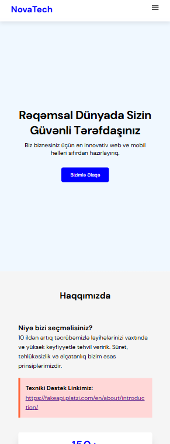
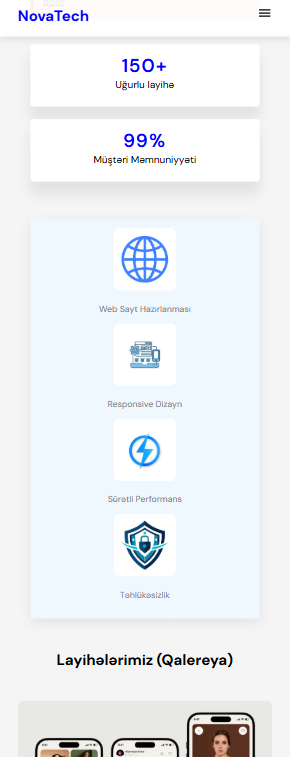
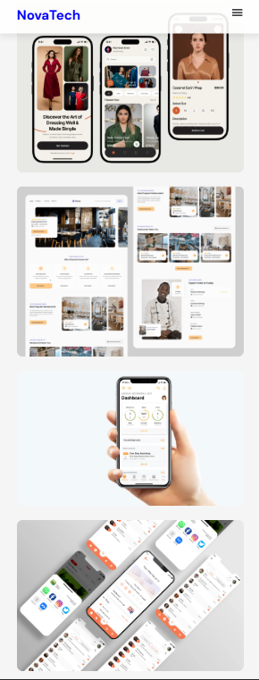
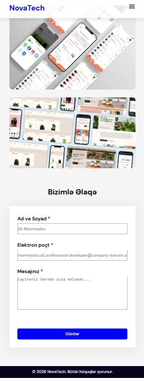
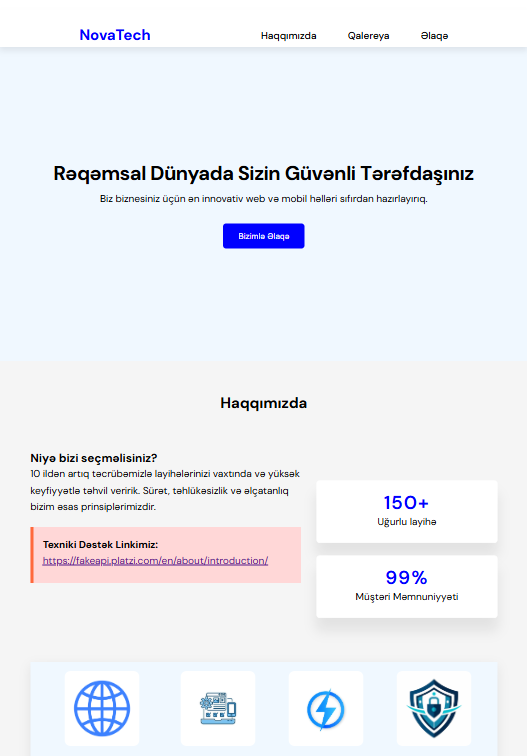
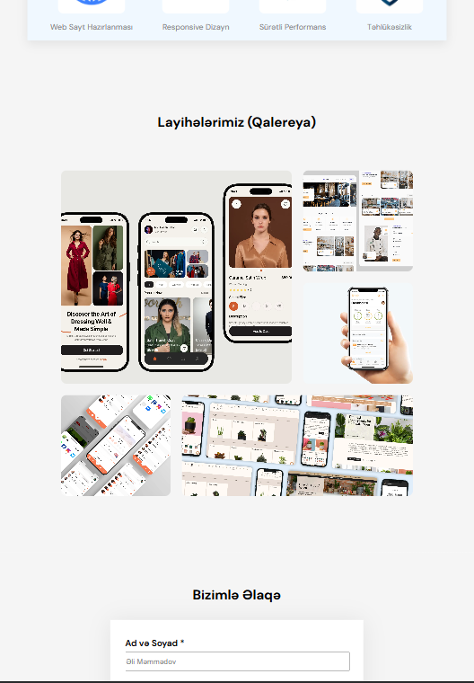
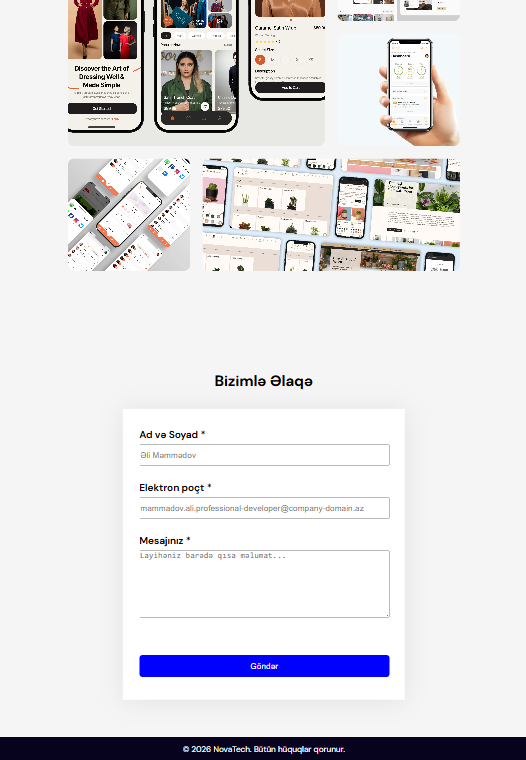
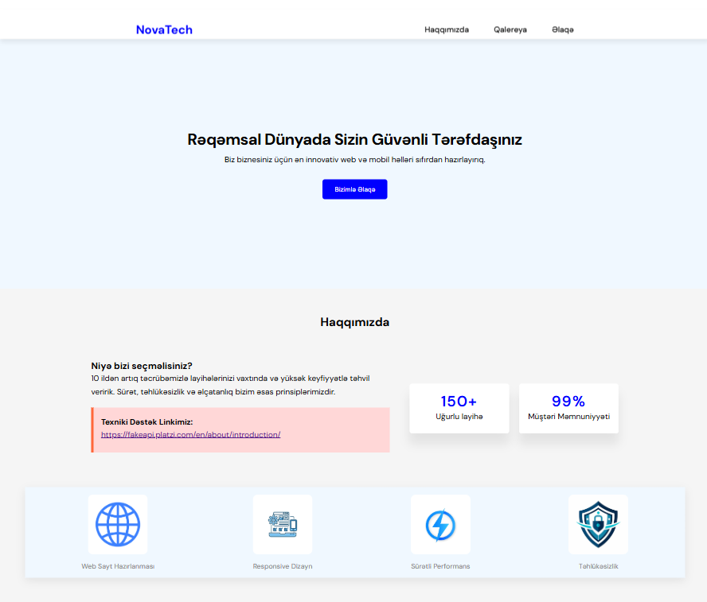
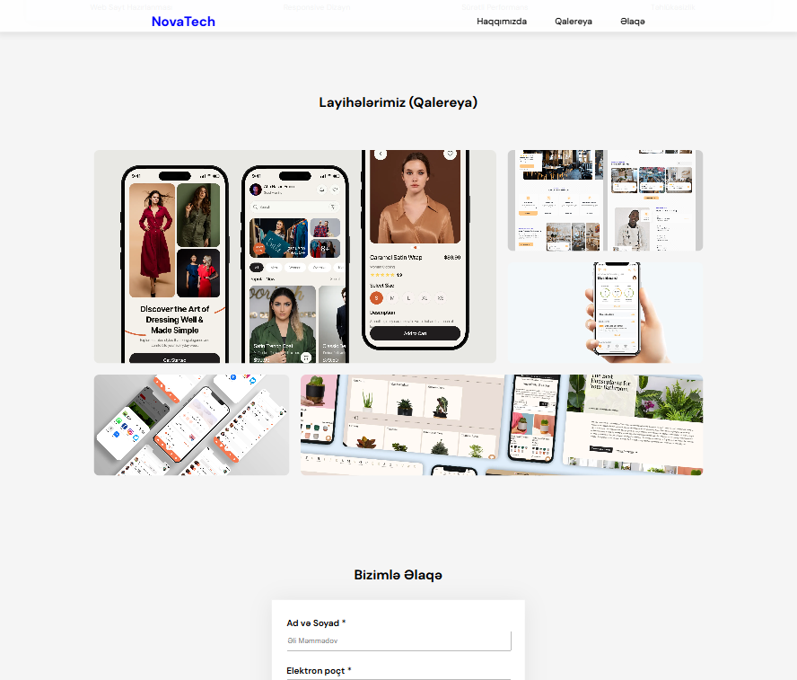
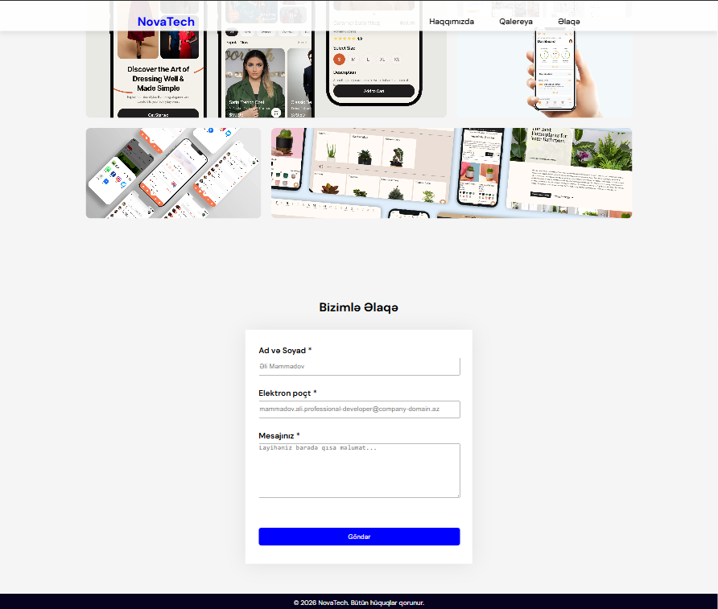

# Responsive Landing Page

## Layihə haqqında

Bu layihə HTML, CSS və JavaScript istifadə edilərək hazırlanmış responsive landing page-dir. Səhifə mobile-first yanaşması ilə hazırlanıb və müxtəlif ekran ölçülərinə uyğun şəkildə işləyir. Layihədə semantik HTML strukturu, responsive dizayn, interaktiv JavaScript funksiyaları və əlaqə formunun client-side validasiyası tətbiq olunub.

---
## Xüsusiyyətlər

- Semantik HTML5 strukturu
- Mobile-first responsive dizayn
- Flexbox və CSS Grid istifadəsi
- Mobil menyunun açılıb-bağlanması
- Smooth Scroll naviqasiyası
- Əlaqə formunun client-side validasiyası
- Email formatının Regex ilə yoxlanılması
- Xəta və uğurlu göndərilmə mesajları
- Accessibility (ARIA, alt atributları və klaviatura ilə istifadə üçün uyğun struktur)

---

## İstifadə olunan texnologiyalar

- HTML5
- CSS3
- JavaScript (Vanilla JS)

---

## Layihə strukturu

```
responsive-landing-page/
│── index.html
│── styles.css
│── script.js
│── screenshots/
│   ├── mobile-1.png
│   ├── mobile-2.png
│   ├── mobile-3.png
│   ├── mobile-4.png
│   ├── tablet-1.png
│   ├── tablet-2.png
│   ├── tablet-3.png
│   ├── desktop-1.png
│   ├── desktop-2.png
│   └── desktop-3.png
```

---
## Layihəni işə salmaq

1. Repository-ni klonlayın.

```bash
git clone https://github.com/hesenovasonaa/responsive-landing-page.git
```

2. Layihə qovluğunu açın.

3. `index.html` faylını brauzerdə açın.

---
## 📸 Ekran görüntüləri

### Mobil görünüş









---

### Tablet görünüş







---

### Desktop görünüş






